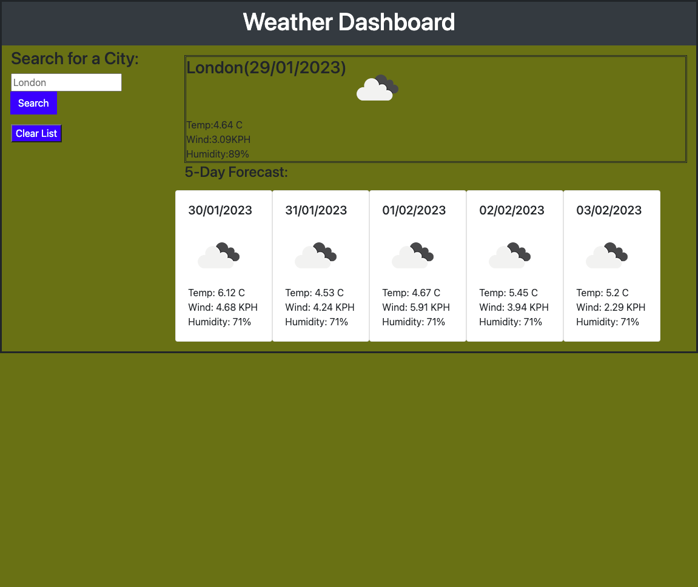
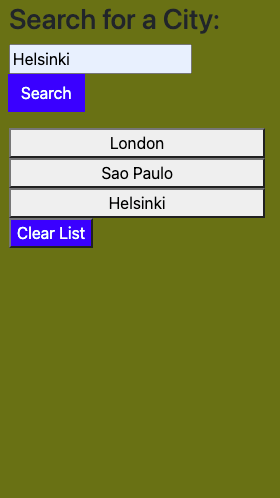

<!-- PROJECT LOGO -->
 

 # Weather Dashboard

 
    This coding creates a weather outlook for multiple cities. 
    
   

<!-- ABOUT THE PROJECT -->
## About The Project

Use this application to retrieve daily weather for more then 200,000 cities.It also gives a 5 days weather forecast . The application saves all your last searches.

Use this link[https://asherbeck10.github.io/Weather-Dashboard/] to get started.

### Built With
This app  run in the browser, feature dynamically updated HTML (DOM),JSON,Bootstrap framework  JavaScript,OpenWeather API and Moment APi

<!-- USAGE EXAMPLES -->
## Usage
1. On loading the page it will preset the daily weather and 5 days forecast for the London .

2. Using the search form to enter a city name.
3. When the search button clicked the city current weather and 5 days forecast will appears.
4. All searched cities are stored and can be reached by clicking on the history button.
5. The history list can be cleared by clicking on the "clear list" button.
6. The app will alert for an invalid city.

<!-- ACKNOWLEDGMENTS -->
## Acknowledgments

* (https://developer.mozilla.org/en-US/)
* (https://www.w3schools.com/js/default.asp)
* https://getbootstrap.com/docs/4.3/getting-started/introduction/
* https://openweathermap.org/
* https://momentjs.com/docs/

